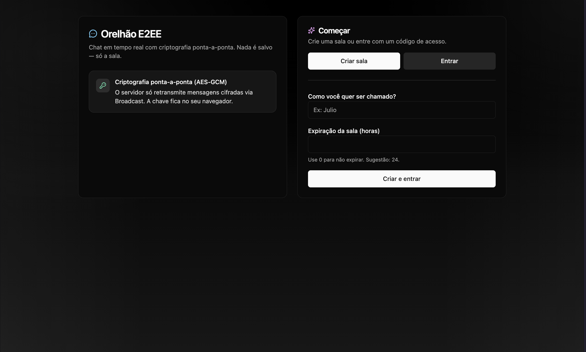
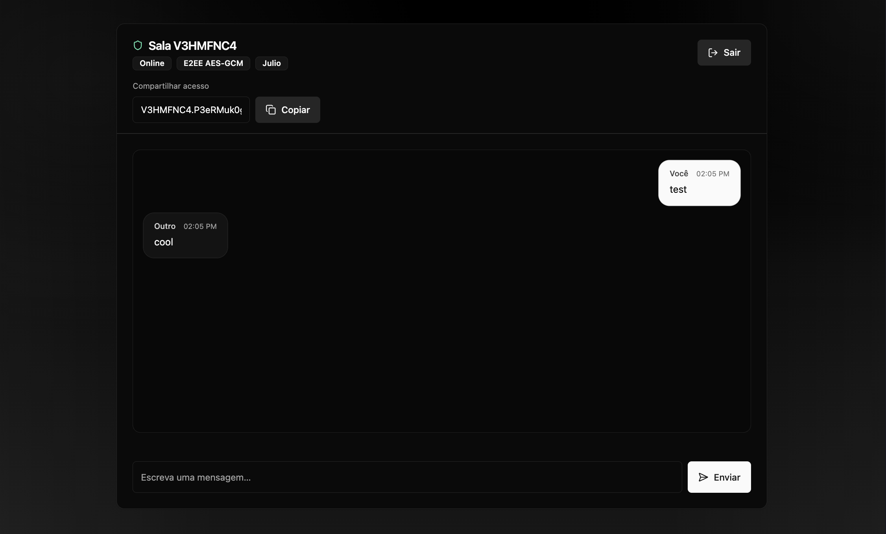

# Orelhão E2EE

Chat em tempo real com criptografia ponta-a-ponta (E2EE) usando Web Crypto (AES-GCM) no navegador e Supabase Realtime (Broadcast) como transporte. As mensagens não são persistidas: o servidor apenas retransmite payloads cifrados; a chave fica no cliente.

**Objetivo do projeto:** demonstrar engenharia de front-end com foco em UX, segurança aplicada e integração com realtime.

## Screenshots

<p align="center">
  
</p>
<p align="center">
  
</p>

## Principais features

- Criação e entrada em salas via convite no formato `ROOMCODE.SECRET`
- Criptografia ponta-a-ponta (AES-GCM) no cliente (Web Crypto API)
- Realtime via Supabase Broadcast (sem gravar mensagens em banco)
- Indicador de digitação (typing)
- Expiração opcional de sala
- UI moderna com Tailwind e componentes utilitários

## Stack

- React 19 + TypeScript
- Vite
- Tailwind CSS
- Supabase (Database + Realtime Broadcast)
- React Hook Form + Zod (validação)
- Radix Slot + utilitários (CVA/clsx/tailwind-merge)

## Como funciona (visão geral)

- Ao criar uma sala, o app gera uma chave simétrica (AES-GCM) e exporta um segredo (string) que compõe o convite `ROOMCODE.SECRET`.
- O backend armazena apenas um hash do segredo para validar acesso à sala (sem guardar a chave em si).
- Mensagens e eventos de digitação são cifrados no browser e enviados como Broadcast; quem tem o segredo consegue decifrar.

## Rodando localmente

### Pré-requisitos

- Node.js (recomendado: LTS)
- Uma instância do Supabase (projeto + Realtime habilitado)

### Instalação

```bash
npm install
```

### Variáveis de ambiente

Crie um arquivo `.env.local` na raiz do projeto:

```bash
VITE_SUPABASE_URL="https://SEU-PROJETO.supabase.co"
VITE_SUPABASE_PUBLISHABLE_KEY="SUA_ANON_KEY"
```

### Banco (Supabase)

Tabela mínima usada pelo app: `rooms`

- `id` (uuid, PK, default uuid_generate_v4() ou gen_random_uuid())
- `code` (text, unique, not null)
- `key_hash` (text, not null)
- `created_at` (timestamptz, default now())
- `expires_at` (timestamptz, null)

O app realiza `insert` e `select` nessa tabela via chave pública (anon). Em ambientes reais, recomenda-se RLS com policies restritivas ou uma camada backend para emissão de tokens.

### Executando

```bash
npm run dev
```

### Build e qualidade

```bash
npm run build
npm run lint
```

## Pontos de engenharia (para avaliação)

- E2EE real no cliente com AES-GCM e payloads versionáveis
- Realtime escalável via canal por sala (`room:<CODE>`) sem persistência de mensagens
- Validação de formulários com schemas (Zod) e estados de erro amigáveis
- Componentização e UI consistente com utilitários de classe
